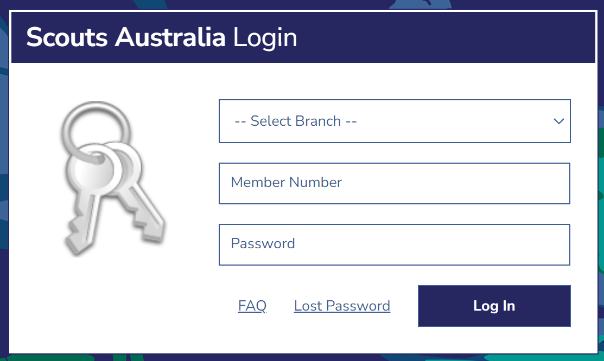
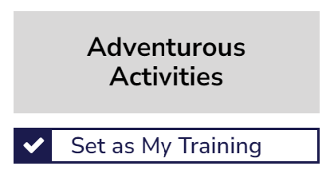
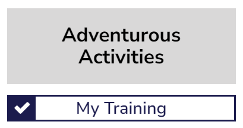
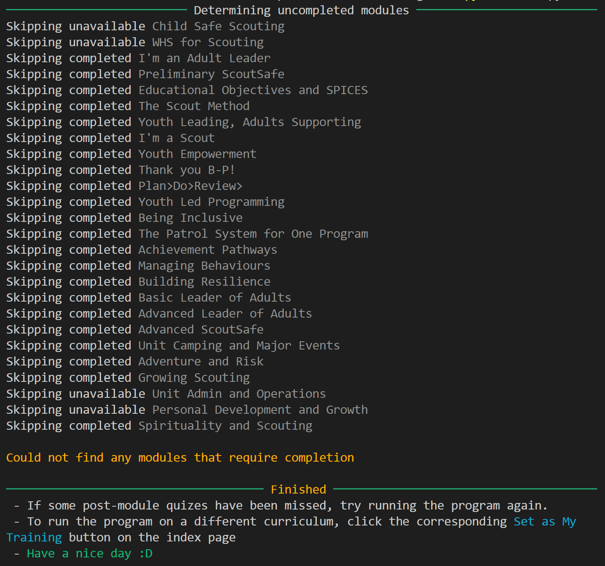
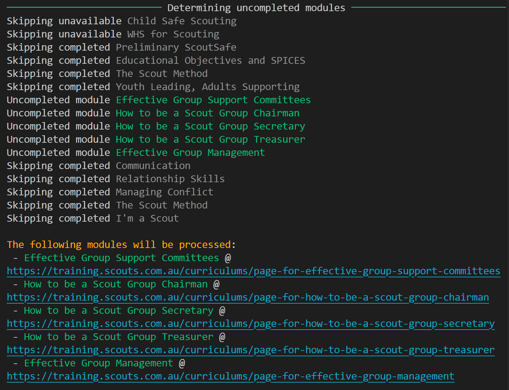
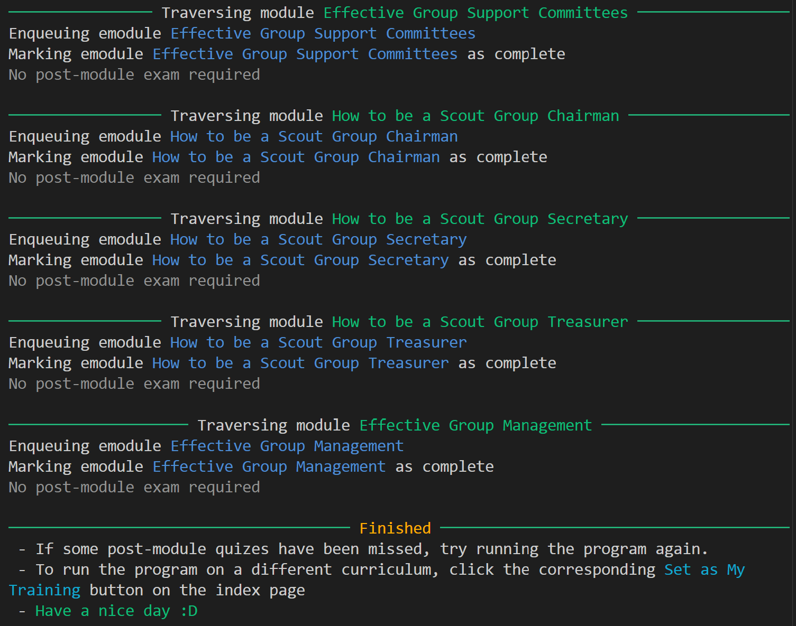

# :robot: Scouts Training Bot
A script written in Python with Selenium to log in to the scouts training website and automatically complete all training modules, watch all videos, open all required documents, and take all tests.

<div align="center">
    
    
    
</div>

## :running: Run via executable
Ensure you have Google Chrome installed before running. Then, download the [Scouts Training Bot latest release](https://github.com/aiden2480/scouts-training-bot/releases/latest) and run it. Once the login screen for the training portal appears, enter your credentials and sign in.



The program will run the training curriculum that is currently selected. To change this, login and scroll to the bottom of the index page, then click `Set as My Training` under the desired curriculum.

<div align="center">
    
    
</div>

## :snake: Run via Python
```
$ pip install -r requirements.txt
$ python main.py
```

You can also optionally add a `.env` file in the root directory, or next to the executable to provide credentials to login with, rather than having to manually sign into the browser. 

| Property   | Description                                |
|------------|--------------------------------------------|
| `branch`   | The two or three letter code of the branch |
| `username` | Your username for Scouts Training          |
| `password` | Your password for Scouts Training          |

## :outbox_tray: Screenshots



